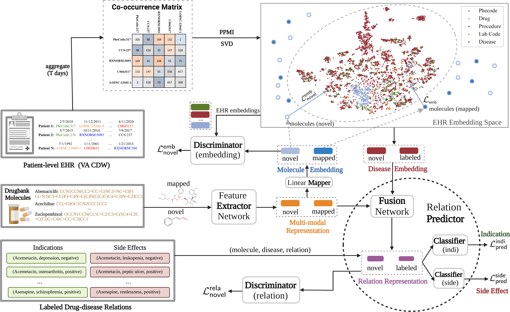

# M2REMAP

Predicting molecule-disease indications and side effects is important for drug development and pharmacovigilance. Comprehensively mining molecule-molecule, molecule-disease, and disease-
disease semantic dependencies can potentially improve prediction performance.

We introduce a Multi-Modal REpresentation Mapping Approach to Predicting molecular-  disease relations (M2REMAP) by incorporating clinical semantics learned from electronic health records
(EHR) of 12.6 million patients. Specifically, M2REMAP first learns a multimodal molecule representation  that synthesizes chemical property and clinical semantic information by mapping molecule chemicals
via a deep neural network onto the clinical semantic embedding space shared by drugs, diseases, and  other common clinical concepts. To infer molecule-disease relations, M2REMAP combines multimodal
molecule representation and disease semantic embedding to jointly infer indications and side effects.

Currently, the codes are proveided only for reference and cannot run due the the lack of the EHR embedding vecotrs. The embedding vectors will be published later.

To run the codes:
1. first install the environment:  setup.sh
2. for drug side effect training: run_SIDER4.sh
3. for drug indication training: run_indication.sh
